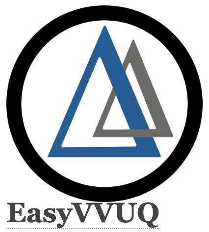

.. _installation:

.. Installation
.. ============

Nektar++ configuration and build
===================

In the following we will provide an example on how to configure and build Nektar++ on a remote machine.

Nektar++ on ARCHER2
===================

First load the following modules:

    .. code-block:: console
		
		export CRAY_ADD_RPATH=yes
                module swap PrgEnv-cray PrgEnv-gnu 
                module load cray-fftw
		module load cmake

Enter the work directory (/work) and clone the Nektar++ code into a folder, e.g. nektarpp

    .. code-block:: console
		
		cd /work/e01/e01/mlahooti
                git clone https://gitlab.nektar.info/nektar/nektar.git nektarpp 

After the code is cloned, enter the nektarpp folder, make a build directory and enter it
    .. code-block:: console
		
		cd nektarpp
                mkdir build
                cd build

From within the build directory, run the configure command. Note the use of CC and CXX to select the special ARCHER-specific compilers.
    .. code-block:: console
		
	CC=cc CXX=CC cmake -DNEKTAR_USE_SYSTEM_BLAS_LAPACK=OFF -DNEKTAR_USE_MPI=ON -DNEKTAR_USE_HDF5=ON -DNEKTAR_USE_FFTW=ON -DTHIRDPARTY_BUILD_BOOST=ON -DTHIRDPARTY_BUILD_HDF5=ON ..

cc and CC are the C and C++ wrappers for the Cray utilities and determined by the PrgEnv module.
SYSTEM_BLAS_LAPACK is disabled since, by default, we can use the libsci package which contains an optimized version of BLAS and LAPACK and not require any additional arguments to cc.
HDF5 is a better output option to use on ARCHER2 since often we run out of the number of files limit on the quota. Setting this option from within ccmake has led to problems however so make sure to specify it on the cmake command line as above. Further, the HDF5 version on the ARCHER2 is not supported at the moment, so here it is built as a third-party library.
They are currently not using the system boost since it does not appear to be using C++11 and so causing compilation errors.
At this point you can run ccmake .. to e.g. disable unnecessary solvers. Now run make as usual to compile the code

    .. code-block:: console
		
		make -j 4 install

For more detailed approach please visit:
    .. code-block:: console
		
		https://www.nektar.info/nektar-on-archer2/
    

FabNEPTUNE Installation
==================
.. image:: ../../logo.png
   :alt: FabNEPTUNE
   :target: https://github.com/UCL-CCS/FabNEPTUNE
   :class: with-shadow
   :scale: 60

Before being able to run FabNEPTUNE [with the assumption that you have been able to run the basic FabSim examples described in the other documentation files, and that you have configured and built Nektar++ (https://www.nektar.info/) on the target machine, and  successfully tested the executable code!], you should install FabNEPTUNE inside of FabSim3. This will  provide functionality to extend FabSim3's workflow and remote submission capabilities to NEPTUNE specific tasks. 

* To install FabSim3 tool, please follow the installation from https://fabsim3.readthedocs.io/en/latest/installation.html

* To install FabNEPTUNE plugin, simple type:

    .. code-block:: console
		
		fabsim localhost install_plugin:FabNEPTUNE
		
		
After installation of FabNEPTUNE the following need to be done.

Custom Environments 
==================

Regardless of the existing python environment on the HPC/local system, you need to setup a custom Python environment including packages that are not in the central installation, the simplest approach here would be the installation of Miniconda locally in your own directories.

Installing Miniconda
==================

First, you should download Miniconda (links to the various miniconda versions on the Miniconda website: https://docs.conda.io/en/latest/miniconda.html)

.. Note:: If you wish to use Python on the Archer2's compute nodes then you must install Miniconda in your /work directories as these are the only ones visible on the compute nodes.

Once you have downloaded the installer, you can run it. 
For example:

    .. code-block:: console
		
		user@login*:~> bash Miniconda3-latest-Linux-x86_64.sh
		
After you have installed Miniconda and setup your environment to access it, you can install whatever packages you wish using the conda install ... command. 
For example: 
    .. code-block:: console
		
		(base)user@login*:~> conda install somepy
		
		
Installing EasyVVUQ
==================

		
Next you need to install EasyVVUQ in your Miniconda environment to access it.
You can install EasyVVUQ using:
    .. code-block:: console
		
		(base)user@login*:~> pip install easyvvuq

and upgrade the library using:
    .. code-block:: console
		
		(base)user@login*:~> pip install easyvvuq --upgrade

Where (base) can be replaced with your new conda environment

For more detailed approach please visit:
    .. code-block:: console
		
		https://github.com/UCL-CCS/EasyVVUQ

Installing EasySurrogate
==================		
		
Next you need to install EasySurrogate in your Miniconda environment to access it.
You can install EasyVVUQ using:
    .. code-block:: console
		
		(base)user@login*:~> pip install easysurrogate

Where (base) can be replaced with your new conda environment

For more detailed approach please visit:
    .. code-block:: console
		
		https://github.com/wedeling/EasySurrogate
		
		
Installing FabSim3
==================

Next you need to install FabSim3 somewhere in your directories and your Miniconda environment to access it.

First you need to check if the following Python modules are already installed

    .. code-block:: console
		
		fabric3==1.13.1.post1
		PyYAML
		numpy
		ruamel.yaml
		rich

Then install both ruamel.yaml and rich package

    .. code-block:: console
		
		pip3 install ruamel.yaml rich

Once you have installed the required packages, then clone FabSim3 from the GitHub repository:

    .. code-block:: console
		
		git clone https://github.com/djgroen/FabSim3.git
		
Finally change to your FabSim3 directory, and type		

    .. code-block:: console
		
		(base)user@login*:~>python3 configure_fabsim.py

Where (base) can be replaced with your new conda environment

For more detailed approach please visit:
    .. code-block:: console
		
		https://github.com/djgroen/FabSim3

Installing QCG-PilotJob
==================

Next you need to install QCG-PilotJob somewhere in your Miniconda environment to access it.

You can install QCG-PilotJob using:
    .. code-block:: console
		
		(base)user@login*:~> pip install qcg-pilotjob

and supplementary packages can be installed using:
    .. code-block:: console
		
		(base)user@login*:~> pip install qcg-pilotjob-cmds
		(base)user@login*:~> pip install qcg-pilotjob-executor-api

Where (base) can be replaced with your new conda environment

For more detailed approach please visit:
    .. code-block:: console
		
		https://github.com/vecma-project/QCG-PilotJob

Creating virtual environment
==================

Finally you need to create a new virtual environment, and update the following files:

    .. code-block:: console
		
		easyvvuq_convection_2d_RUN_localhost.py
                easyvvuq_convection_2d_RUN_remote.py

which  are found in ``plugins/FabNEPTUNE/config_files/convection_2d_easyvvuq_InRuAn*_QCGPJ`` and ``plugins/FabNEPTUNE/config_files/convection_2d_easyvvuq_easysurrogate_InRuAn*_DAS_QCGPJ``

This environment is used by EasyVVUQ campaign. 

You can install virtualenv using:
    .. code-block:: console
		
		curl https://bootstrap.pypa.io/get-pip.py -o get-pip.py
                python3 get-pip.py --user
                pip install --user virtualenv
		
		
Then to create private virtual environment type:
    .. code-block:: console
		
		virtualenv venv
                . venv/bin/activate	
		
Once you have installed the required packages and created virtual environment, then install QCG-PilotJob using:

    .. code-block:: console
		
		pip install qcg-pilotjob

and supplementary packages can be installed using:
    .. code-block:: console
		
		pip install qcg-pilotjob-cmds
		pip install qcg-pilotjob-executor-api

		
For more detailed approach please visit:
    .. code-block:: console
		
		https://qcg-pilotjob.readthedocs.io/en/develop/installation.html
