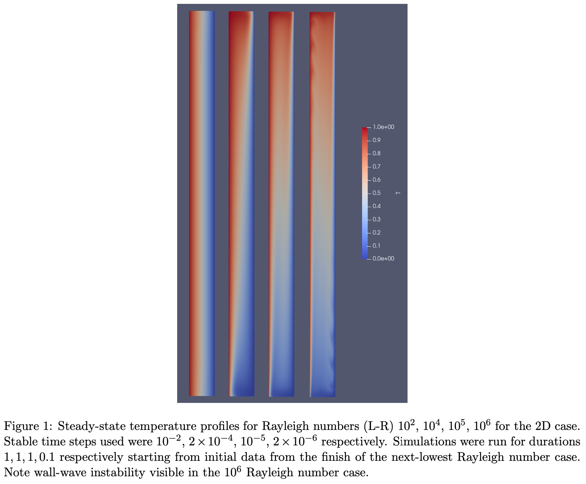

.. _workflow:

FabNEPTUNE Workflow
==============

Introduction
------------
FabNEPTUNE is a tool that allows for the easy execution of NEPTUNE project simulations(especially convection2d and convection3d) in local or remote machines. This section of the documentation will cover an example of how one would go about configuring FabNEPTUNE and running a simulation using any NEPTUNE project code.

Example of workflow for FabNEPTUNE (convection2d and convection3d)
------------------------------------------------------------------
An already implemented example from FabNEPTUNE's projects will be explained in the following 

Convection2d and convection3d
-----------------------------
These Nektar++ session files represent a model consisting of a fluid-filled tank with the rough proportions of a cereal packet. Vertical natural convection is triggered by maintaining a constant temperature difference across the space between the two largest faces. This geometry represents experimental apparatus being used at the University of Leeds and designed to reproduce and go beyond classic experiments by Elder [1].
Two examples are provided - a 3D one, with a large mesh containing 189,000 cuboidal finite elements (this has 189, 000 × (p + 1)3 degrees of freedom, where p is the order of the finite elements and takes the values 2, 3, 4, ... in Nektar++; this means a minimum of 1.5M dofs in the simulation), and a 2D  mesh (3375 quadrilateral finite elements - the relevant cross-section of the 3D case) which is suitable for running on single PC. In both cases, there is a file with the solver parameters (e.g. convection 2d.xml) and another file containing the relevant mesh (e.g. convection 2d mesh.xml). 
The meshes can be uncompressed using the command:

    .. code-block:: console
		
		nekmesh convection 2d mesh.xml convection 2d mesh.xml:xml:uncompress

and can be converted into ParaView format using

    .. code-block:: console
		
		fieldconvert convection 2d.xml convection 2d mesh.xml convection 2d mesh.vtu

What to do in order to run the session files - obtain and build the latest version of Nektar++. The session files are used with the incompressible Navier-Stokes solver and are executed with e.g. mpiexec -np 8 incnavierstokessolver convection 2d.xml convection 2d mesh.xml. Once run, the output .fld files can be processed into ParaView format with the command:

    .. code-block:: console
		
		fieldconvert convection 2d.xml convection 2d mesh.xml convection 2d.fld convection 2d.vtu

There is one adjustable physical parameter - the dimensionless Rayleigh number (Ra in the session file) which is proportional to the applied temperature difference. The dimensionless Prandtl number (Pr in the session file) is fixed by the choice of fluid in the tank and I have given this the value of 7.0 which is appropriate for water. For smaller Ra (e.g. c.102) the output is dominated by conductive heat transfer. For larger values c.104, a laminar convective cell forms. The amount of heat transfer is quantified by the mean of the integrals of the heat flux (= −∇T) on the heated / cooled boundaries, which is called the Nusselt number, and is normalized, to unit area, to give a value of unity in the conducting (small Ra) limit. The most interesting behaviour occurs for Ra larger than about 106 where there is not a stable steady-state solution but rather a transition to a turbulent state triggered by wall-wave instabilities which ascend the hot wall and descend the cold. These features are common to 2D and 3D, but in the 3D case there is additional instability to fluctuations that disrupt the symmetry along the axis newly-present in the 3D case.

One possible pitfall is that the explicit part of the time-stepping means that there is a maximum time step size above which the simulation is unstable. If this happens, the solver will crash, giving an error message that NaN has been encountered or max number of iterations is exceeded. Experience in how large a timestep is allowed can be gained by running the 2D simulation. Note the instability is related to the maximum local fluid speed and hence is worse as Ra is increased, demanding a smaller time step size. Note also that it is wise to move up in Ra e.g. in decades, and using the flow field from the previous Ra value simulation as initial data - this avoids a violent perturbation to the system at startup, which is prone to having a very small time step size.
Increasing Ra means that the simulation has finer features (e.g. thinner boundary layers) and needs more accuracy. Increasing the precision is done by increasing the integer spectral order p which is represented by the parameter NUMMODES in the session file. Note NUMMODES is equivalent to p+1. Note increasing p increases the number of degrees of freedom and hence the computational demand imposed by the simulation.

Outputs - Nektar++ filters can be used to produce simulation output as time series (uncomment lines relat- ing to the desired filter in convection 2d.xml to use). In particular, the Nusselt number can be calculated using the built-in AeroForces filter if a small modification is made to one file (FilterAeroForces.cpp) in the code before compilation. A copy of the modified file with modifications for 2D and 3D (either-or, must alter file before compilation to choose which) meshes is included (see code marked TRIALCODE in the file, plus attendant comments); if using this, a good test is to ensure a Nusselt number of approx. unity can be obtained from the simulation in the small Rayleigh number limit (you will need to normalize to the appropriate area). Note the relevant number is the F1-press column of the generated output file. Other filters can calculate fields at a point if desired, se e.g. HistoryPoints.

References
    .. code-block:: console
		
		[1] J.W. Elder, Turbulent free convection in a vertical slot, J. Fluid Mech. (1965) vol.23 part 1 pp.99-111.
    
    
Submitting convection2d and convection3d jobs
------------------------------------------------------------------

Before submitting the simulation to a remote machine, two YAML files must be edited. First we need to modify the file

      .. code-block:: yaml
      
           FabSim3/deploy/machines_user.yml 

and add the login credentials in the template so that FabNEPTUNE knows where to run the simulation. 
The following example shows what parameters (username, project, budget and sshpass) need to be defined for a remote machine name ARCHER2 (the UK National Supercomputer). Other machines may have more or less parameters that need to be defined.

	.. code-block:: yaml
	
                  archer2:		
                         username: "<your-username>"
                         project: "e123"
                         budget: "e123-user"
                         sshpass: "<ARCHER2-password>"
                         manual_sshpass: true

The next important file that needs to be updated is 

        .. code-block:: yaml
	
              FabSim3/plugins/FabNEPTUNE/machines_FabNEPTUNE_user.yml 

In this file you can set the path to the convection2d/3d executable on the remote machine which are Nektar++ executable and the input file names, and the remote run command. Here we assume that you have been able to run the basic FabSim examples described in the other documentation files, and that you have configured and built Nektar++ (https://www.nektar.info/) on the target machine, and successfully tested the executable code!. However, most HPC clusters could have Nektar++ available as a module and this can be added in the loaded modules section of the file. This means that the ``convection2d_exec`` parameter can be set to the path of the compiled executable. For example, archer2 remote machine might look like:

	.. code-block:: yaml

		archer2:
		   convection2d_exec: ".../nektar++/build/dist/bin/IncNavierStokesSolver"
		   ...
		   FabNEPTUNE_params:
                         convection_2d_input: "convection_2d.xml"
                         convection_3d_input: "convection_3d.xml"
                         sweep_dir_name: "SWEEP"

                   ...
                   run_command_remote: "srun --nodes=1 --ntasks=1 --exclusive --oversubscribe --mem=25000M"
		   ...
		   ...
		   ...
		   modules:
		      loaded: ["python"]

After all the above configurations done we still would need to update ``FabSim3/fabsim/deploy/templates``. For example, the template (slurm-archer2) for archer2 remote machine might look like:

           .. code-block:: bash
	   
	         #!/bin/bash
                 ## slurm-archer2
                 ## number of nodes
                 #SBATCH --nodes 70

                 ## SBATCH --nodes $nodes
                 #SBATCH --ntasks=8960
                 ## task per node
                 #SBATCH --tasks-per-node=$corespernode
                 #SBATCH --cpus-per-task=1
                 ## wall time in format MINUTES:SECONDS
                 #SBATCH --time=$job_wall_time

                 ## grant
                 #SBATCH --account=$budget

                 ## stdout file
                 #SBATCH --output=$job_results/JobID-%j.output

                 ## stderr file
                 #SBATCH --error=$job_results/JobID-%j.error

                 #SBATCH --partition=$partition_name
                 #SBATCH --qos=$qos_name

                 export OMP_NUM_THREADS=1
                 export FI_MR_CACHE_MAX_COUNT=0
                 export PATH="/mnt/lustre/a2fs-work2/work/e723/e723/kevinb/miniconda3/bin:$PATH"
                 export PATH="/mnt/lustre/a2fs-work2/work/e723/e723/kevinb/.local/.local/bin:$PATH"
                 export NEK_DIR=/mnt/lustre/a2fs-work2/work/e723/e723/kevinb/nektarpp/build
                 export NEK_BUILD=$NEK_DIR/dist/bin
                 export LD_LIBRARY_PATH=/opt/gcc/10.2.0/snos/lib64:$NEK_DIR/ThirdParty/dist/lib:$NEK_DIR/dist/lib64:$LD_LIBRARY_PATH
                 export PATH="/mnt/lustre/a2fs-work2/work/e723/e723/kevinb/nektarpp/build/dist/bin:$PATH"

Once all have been done, we can submit a simulation to a remote machine using the command:

    .. code-block:: console
		
		fabsim archer2 Convection2D_local:convection_2d_test	

and copy the results back to our local machine with

    .. code-block:: console
		
		fabsim  archer2  fetch_results
		
